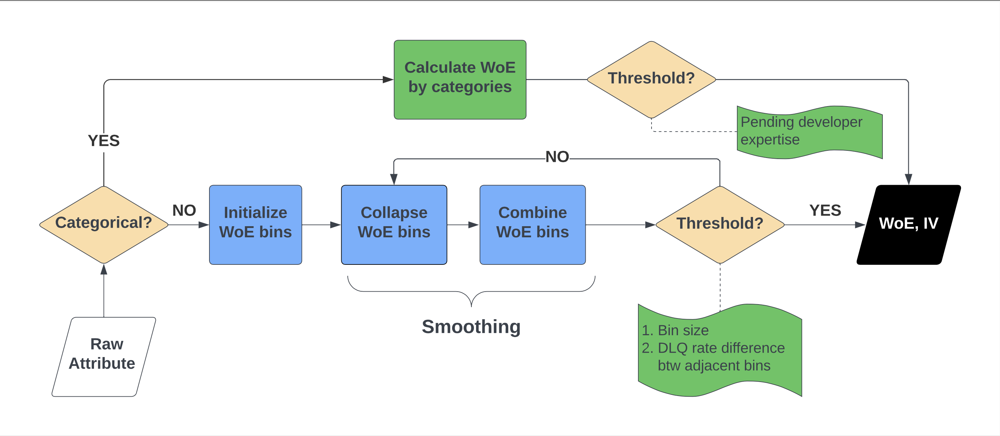
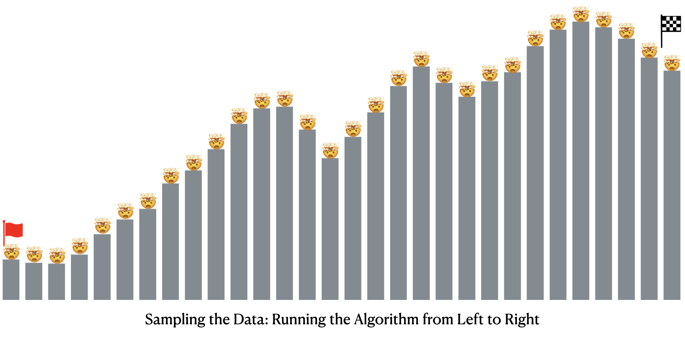
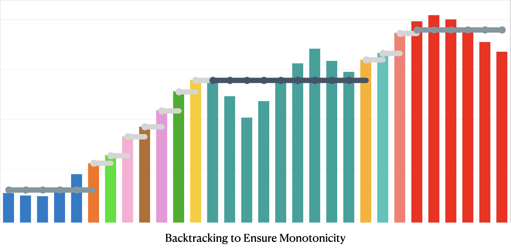
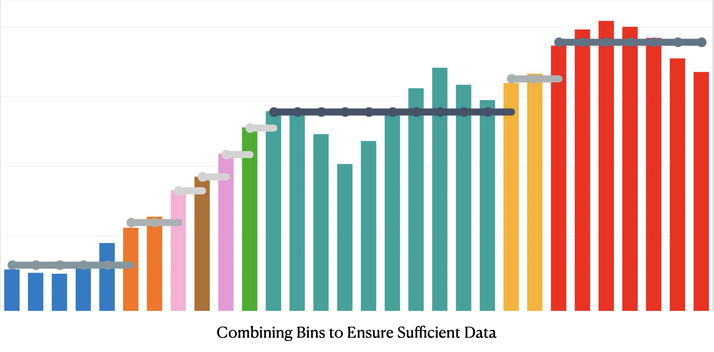
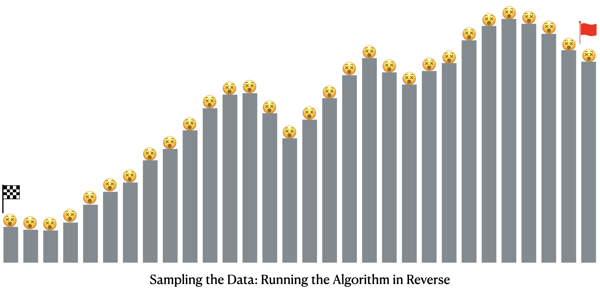
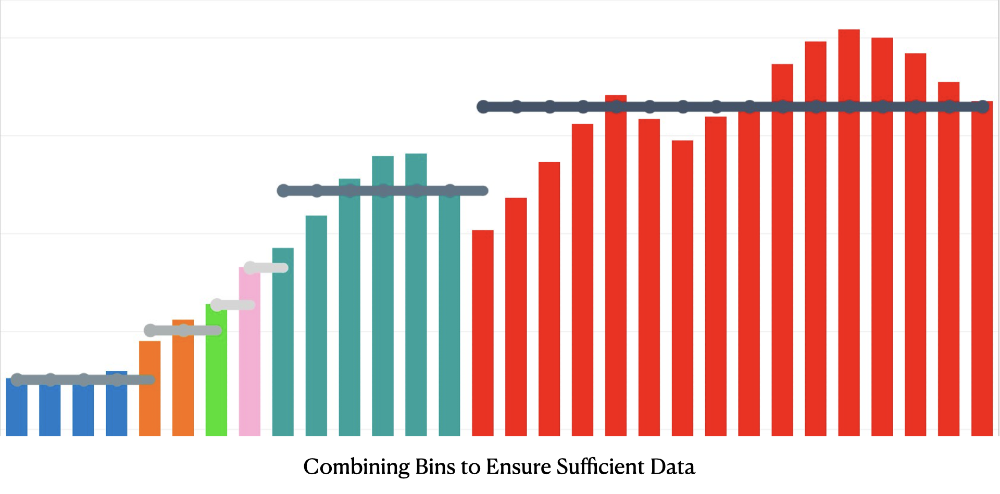
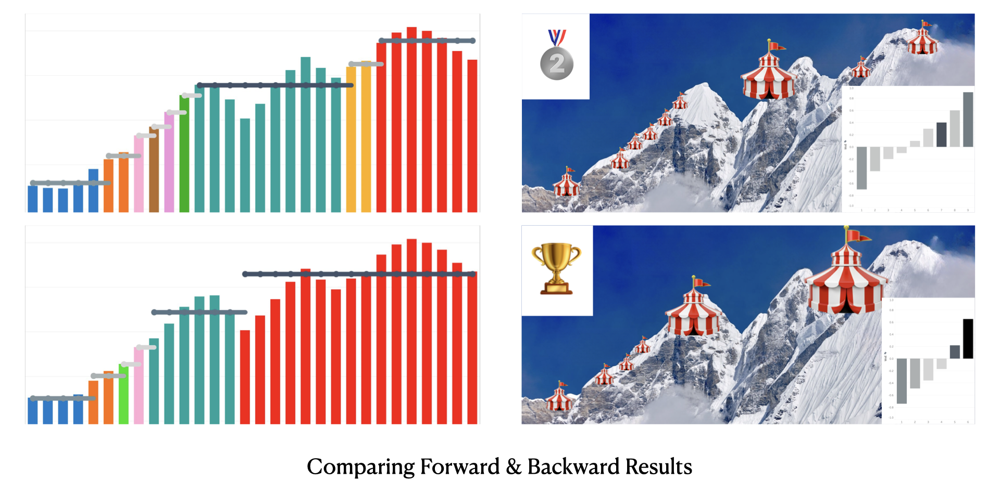

# Automated, Weighted, Monotonic Weight of Evidence (WoE) Transformation Module in Credit Risk Modeling

## Overview
This project implements an **Automated, Weighted, Monotonic Weight of Evidence (WoE) Transformation Module** designed for **credit risk modeling**. It enhances the transformation of both **categorical** and **continuous features** into monotonic WoE values, supporting downstream modeling tasks.

The algorithm aims to automate the transformation of both categorical and numerical variables into monotonic WoE values, which are essential for making the relationship between an attribute and credit risk more interpretable, regulatory-compliant, and accurate.

Data Disclaimer:
1. All data utilized in this project is simulated and does not contain any sensitive or proprietary information.
1. This project serves as a theoretical study to illustrate how the Weight of Evidence (WoE) methodology works.
1. No actual code or proprietary algorithms are shared in this repository to comply with intellectual property policies.

## Features
- **Automated Transformation**: Automatically converts any input variable (categorical or numerical) into WoE values.
- **Monotonicity Enforcement**: Ensures WoE values follow a consistent monotonic trend with risk, improving the interpretability and stability of models.
- **Weighted Data Handling**: Incorporates weights for data points, a novel feature not commonly found in existing WoE transformation methods.
- **Dual-Direction Algorithm**: Provides flexibility by generating WoE values both forward and backward, allowing the modeler to choose the result with the higher Information Value (IV).

## Introduction to Weight of Evidence (WoE)
In credit risk modeling, accurately capturing the relationship between predictive attributes (e.g., age, credit card type) and the likelihood of credit events (e.g., delinquency, default) is essential. Naive methods often fail to represent risk accurately due to the over-emphasis on larger data segments, data imbalance, or non-linearity in the relationship between variables.

The **Weight of Evidence (WoE)** transformation offers a robust solution by converting categorical and continuous variables into log-odds, which simplifies their use in models like **logistic regression**. WoE serves as an effective **pre-processing step** that provides several advantages:
1. **Handling of Categorical Variables**: WoE transforms categories into continuous values, avoiding one-hot encoding and reducing model complexity.
2. **Improved Risk Representation**: WoE expresses predictor-event relationships in odds, offering clearer risk interpretation and reducing overfitting on sparse data.
3. **Addressing Data Imbalance**: WoE adjusts for imbalances, preventing high-frequency, low-risk categories from dominating the model.
4. **Handling Non-Linearity**: WoE bins continuous variables, capturing non-linear patterns missed by untransformed logistic regression models.
5. **Monotonicity**: Ensures a consistent, interpretable relationship between predictor values and risk, improving model accuracy and compliance.

Incorporating monotonicity in WoE transformations further enhances model **accuracy**, **interpretability**, and **regulatory compliance** by ensuring a consistent relationship between predictor values and risk. This module automates the WoE transformation process, accounting for weighted data points, ensuring that the transformation is both efficient and aligned with best practices for credit risk modeling.

## Project Structure
- `code/`  
  Contains example scripts simulating the workflow. The actual code isn't shared due to IP restrictions; these examples are for illustration only.
- `plots/`  
  Includes visualizations generated from simulation data to illustrate outcomes.
- `data/`  
  Contains example datasets for simulations, used purely for demonstration.

### Weight of Evidence (WoE)
The Weight of Evidence quantifies how much each category contributes to the likelihood of an event occurring (e.g., default). It is calculated as:
$$\text{WoE} = \ln\left(\frac{\text{Good Rate}}{\text{Bad Rate}}\right) = \ln\left(\frac{p}{1-p}\right)$$

\[
\text{WoE} = \ln\left(\frac{\text{Good Rate}}{\text{Bad Rate}}\right) = \ln\left(\frac{p}{1-p}\right)
\]

Where:
- \( p = \frac{\text{Number of Good Events}}{\text{Total Number of Good Events}} \)
- \( 1-p = \frac{\text{Number of Bad Events}}{\text{Total Number of Bad Events}} \)

### Information Value (IV)
Information Value measures the predictive power of a feature and is calculated as:

\[
\text{IV} = \sum (\text{Good Rate} - \text{Bad Rate}) \times \text{WoE}
\]

Where:
- The sum is taken over all categories of the attribute.

### Log-Odds
The log-odds transform the probability of an event into a logarithmic scale. It is defined as:

\[
\text{Log-Odds} = \ln\left(\frac{p}{1-p}\right)
\]

Where:
- \( p \) is the probability of the event occurring (e.g., the probability of default).

---

These formulas are foundational in understanding the concepts of Weight of Evidence and Information Value in credit risk modeling.

## Algorithm Flowchart
The flowchart below summarizes the key steps in calculating WoE and IV:

1. **Check if the Attribute is Categorical**  
   If the raw attribute is categorical, WoE is calculated by category. Otherwise, proceed to binning.
2. **Initialize WoE Bins**  
   For numerical attributes, bins are initialized (e.g., using equal-width or quantile binning).
3. **Collapse WoE Bins**  
   Optionally, bins may be collapsed to reduce the number of distinct groups based on similarity in WoE values.
4. **Combine WoE Bins**  
   Further bin combination can be applied to smooth the WoE values.
5. **Check Threshold**  
   The process checks if WoE meets a predefined threshold (e.g., based on bin size or delinquency rate differences). If not, continue adjusting bins.
6. **Calculate WoE & IV**  
   Once the bins are finalized, the WoE and IV metrics are calculated, providing insights into the predictive power of the attribute.

## Figures

## Demo

**Step 1: Introduction to the WoE Algorithm**  
Explore how the monotonic **Weight of Evidence (WoE)** algorithm operates through a **mountaineering analogy**.

---

**Step 2: Identifying the Trend**  
The algorithm identifies the **overall trend** in the data (upward in this case), transforming complex data into **meaningful numerical values**.

---

**Step 3: Sampling the Data**  
The algorithm samples data from **left to right**, covering variables like **utilization** and **delinquency rates**.

---

**Step 4: Initializing the WoE Bins**  
Bins are initialized for the **Weight of Evidence (WoE)**, maintaining **flexibility** in data grouping.

---

**Step 5: Ensuring Monotonicity: Backtracking**  
To maintain **monotonic WoE values**, the algorithm creates new bins when the trend is followed. If not, it backtracks to **merge bins** and restore monotonicity.

---

**Step 6: Combining Bins for Sufficient Data**  
Bins are merged to ensure each contains **sufficient data** for accurate analysis.

---

**Step 7: Final Result: Forward Pass**  
The final result shows **monotonic WoE values** in the forward direction, depicted as **base camps** on the data.

---

---

**Step 8: Running the Algorithm in Reverse**  
The algorithm runs **in reverse**, from right to left, following the same process to ensure **consistency**.

---

**Step 9: Combining Bins in Reverse**  
Bins are merged in the reverse direction while ensuring all criteria, like **sufficient data** and **monotonicity**, are satisfied.

---

**Step 10: Final Result: Reverse Pass**  
The final result shows **monotonic WoE values** in the reverse direction.

---

**Step 11: Comparing Forward & Backward Results**  
Results from both the **forward** and **reverse** passes are compared. The algorithm selects the **WoE values** with the highest **Information Value (IV)** for each bin.

## Requirements
- Python 3.x
- `pandas`, `numpy`, `scipy`, `matplotlib`, `pyspark`
